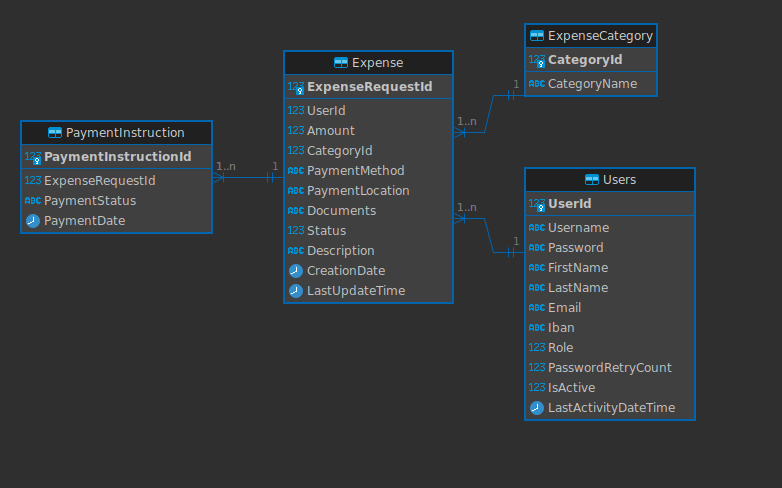
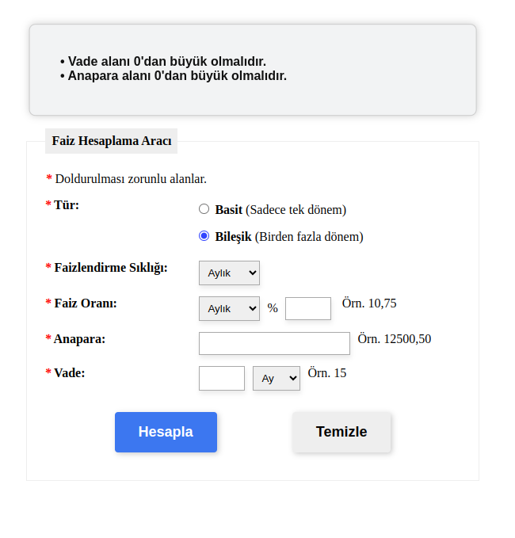
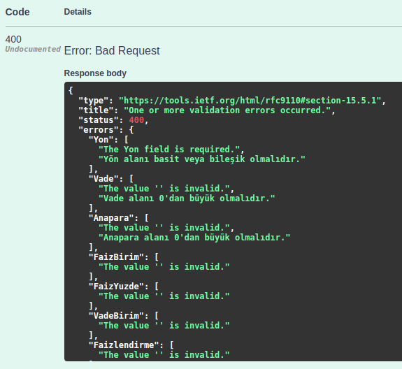
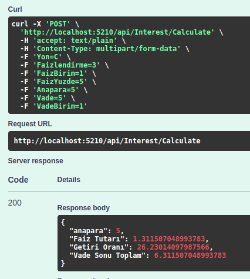
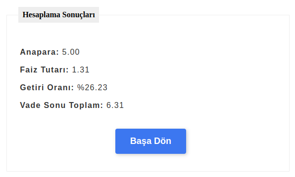
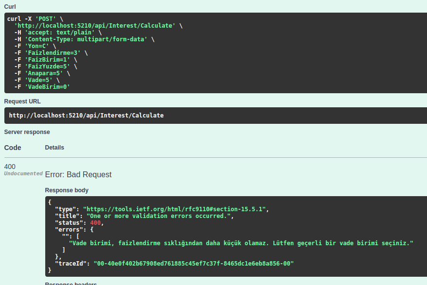
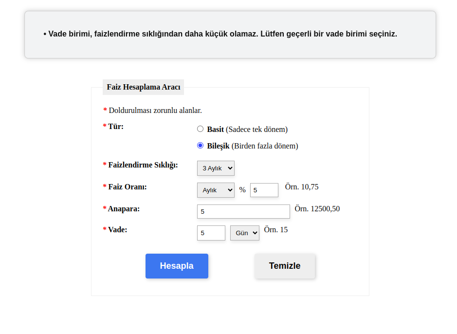

# Faiz Hesaplama Uygulaması

Bu uygulama, finansal faiz hesaplamalarını gerçekleştiren basit bir arayüz ve API içerir. Uygulama, [faiz.hesaplama.net](https://faiz.hesaplama.net/) adresindeki hesaplama yöntemini referans almaktadır. Ayrıca, günlük gün sayısını 360 olarak kabul eder.

## API Endpointleri

Uygulama şu endpointlere sahiptir:

- `/calculate-interest`: Faiz hesaplamasını gerçekleştiren ana endpoint.
- `/health`: Uygulama sağlığını kontrol etmek için kullanılan endpoint.



## Arayüz

Uygulamanın arayüzüne http://localhost:5210/ adresinden erişilebilir. Arayüz ekranı şu parametreleri içerir:

- **Yon**: Hesaplama Türü (C = Bileşik Faiz, S = Basit Faiz)
- **Faizlendirme**: Faizlendirme Sıklığı (0-12 arası değer alabilir)
- **FaizBirim**: Faiz Oranının Zaman Birimi (0, 1, 12 değerlerini alabilir)
- **FaizYuzde**: Faiz Oranı
- **Anapara**: Anapara Tutarı
- **VadeBirim**: Vadeli İşlem Zaman Birimi (0, 1, 12 değerlerini alabilir)
- **Vade**: Vadeli İşlem Zamanı


## Parametre Açıklamaları

- **Yon (Type: String)**:
    * C: Bileşik Faiz
    * S: Basit Faiz
- **Faizlendirme (Type: Int)**:

    * 0: Günlük, 1: Aylık, 3: 3 Aylık, 6: 6 Aylık, 12: Yıllık ifade eder.
    * 0-12 arası(dahil) değer alabilir. 
    * Örnek olarak 5 ayda bir faizlendirme yapılacaksa Faizlendirme = 5 olmalıdır.
- **FaizBirim (Type: Int)**:

    * 0: Günlük, 1: Aylık, 12: Yıllık ifade eder.
    * Sadece 0 1 12 değerlerini alabilir. 
    * Örnek olarak 4 aylık faiz oranı girilecekse FaizBirim = 1, FaizYuzde = 4 olmalıdır.

- **FaizYuzde (Type: Decimal)**:
    * Örnek olarak %4 faiz oranı girilecekse FaizYuzde = 4 olmalıdır.

- **Anapara (Type: Decimal)**:
    * Örnek olarak 1000 TL anapara girilecekse Anapara = 1000 olmalıdır.

- **VadeBirim (Type: Int)**:
    * 0: Günlük, 1: Aylık, 12: Yıllık ifade eder.
    * Sadece 0 1 12 değerlerini alabilir. 
    * Örnek olarak 4 aylık vade girilecekse VadeBirim = 1, Vade = 4 olmalıdır.

- **Vade (Type: Int)**: \
    * Ana paranın vade sonunda geri alınacağı zamanı belirtir.
## Validasyonlar

Gerekli validasyonlar yapılmıştır.



## Kullanım

### Örnek Request

Örnek bir HTTP isteği aşağıdaki gibidir:

```
POST http://localhost:5210/api/Interest/Calculate
accept: text/plain
Content-Type: multipart/form-data; boundary=WebAppBoundary

--WebAppBoundary
Content-Disposition: form-data; name="Yon"

S
--WebAppBoundary
Content-Disposition: form-data; name="Faizlendirme"

1
--WebAppBoundary
Content-Disposition: form-data; name="FaizBirim"

1
--WebAppBoundary
Content-Disposition: form-data; name="FaizYuzde"

5
--WebAppBoundary
Content-Disposition: form-data; name="Anapara"

5
--WebAppBoundary
Content-Disposition: form-data; name="Vade"

5
--WebAppBoundary
Content-Disposition: form-data; name="VadeBirim"

1
--WebAppBoundary--
```

cUrl ile örnek bir istek:

```
curl -X 'POST' \
  'http://localhost:5210/api/Interest/Calculate' \
  -H 'accept: text/plain' \
  -H 'Content-Type: multipart/form-data' \
  -F 'Yon=C' \
  -F 'Faizlendirme=3' \
  -F 'FaizBirim=1' \
  -F 'FaizYuzde=5' \
  -F 'Anapara=5' \
  -F 'Vade=5' \
  -F 'VadeBirim=1'
```

### Başarılı Çıktı Örneği 
\


### Başarısız Çıktı Örneği
\


